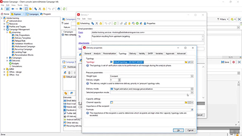
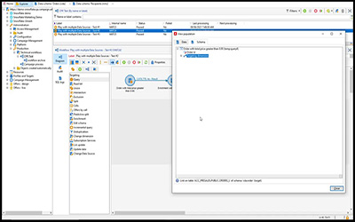

# Tutorials della console client di Adobe Campaign v8

Adobe Campaign fornisce una piattaforma per la progettazione di customer experience cross-channel e fornisce un ambiente per l’orchestrazione visiva delle campagne, la gestione delle interazioni in tempo reale e l’esecuzione cross-channel. La presente guida utente contiene video e tutorial sulle numerose funzioni e caratteristiche della console client di Adobe Campaign V8.

Consulta

>[!INFO]
> Hai delle domande? Vuoi condividere la tua esperienza o scambiare idee con altri utenti? O forse vuoi inviare al team Adobe un feedback sui contenuti di apprendimento? Partecipa alla conversazione nel [thread della community di apprendimento Adobe Campaign](https://experienceleaguecommunities.adobe.com:443/t5/adobe-campaign-classic/join-the-discussion-on-adobe-campaign-learning/td-p/419096).
> 
> Questi tutorial non sono quelli che stai cercando?
> Consulta la [Tutorial sull’interfaccia utente web di Adobe Campaign](https://experienceleague.adobe.com/docs/campaign-web-learn/tutorials/overview.html) per istruzioni su come utilizzare l’interfaccia utente di Campaign Web.

>[!NOTE]
> Campaign v8 è attualmente disponibile solo come Managed Cloud Service e non può essere distribuito in ambienti on-premise o ibridi. La migrazione automatizzata da un ambiente esistente di Campaign Classic v7 non è ancora disponibile.
>
>Consulta la [documentazione del prodotto](https://experienceleague.adobe.com/docs/campaign/campaign-v8/new/v7-to-v8.html?lang=it) per ulteriori informazioni sulla transizione da Classic v7 a v8.

## Scelti dallo staff

<table>
<tr>
  <td>
    
    

      <a href="/help/get-started/create-a-marketing-plan-programs-and-campaigns.md">
    <strong>Creare un piano di marketing</strong>
    </a>
    

    

    <em>Scopri come creare un piano di marketing, un programma e una campagna.</em>
    

  </td>
   <td>
    
    

      <a href="./content-creation/create-and-design-email-deliveries.md">
    <strong>Creare e progettare consegne e-mail</strong>
    </a>
    

    

    <em>Scopri il processo di creazione di una consegna e-mail e come progettare e personalizzare i contenuti.
</em>
    

  </td>
  <td>
    
    

      <a href="./send-messages/fatigue-management/typology-rules-for-fatigue-management.md">
    <strong>Gestire l’eccesso utilizzando le regole di tipologia</strong>
    </a>
    

    

    <em>Scopri come implementare la gestione dell’eccesso in Adobe Campaign utilizzando le regole di tipologia. </em>
    

  </td>
</tr>
<tr>
</td>
  <td>
    
    

      <a href="./reporting/generate-a-descriptive-analysis-report.md">
    <strong>Generare un rapporto di analisi descrittivo</strong>
    </a>
    

    

    <em>Scopri come generare un rapporto di analisi descrittivo da un flusso di lavoro.</em>
    

  </td>
  <td>
   
     

      <a href="./data-management/data-management-fundamentals.md">
    <strong>Nozioni di base sulla gestione dei dati con i flussi di lavoro</strong>
    </a>
    

    

    <em>Scopri le dimensioni di targeting e le tabelle di lavoro e come Adobe Campaign gestisce i dati tra diverse origini dati.</em>
    

  </td>
  <td>
   
     

      <a href="./data-management/api-staging-mechanism.md">
    <strong>Meccanismo di staging per le API con FFDA</strong>
    </a>
    

    

    <em>Scopri come funziona il meccanismo di staging per le API con Full FDA.</em>
    

  </td>
</tr>
</table>

